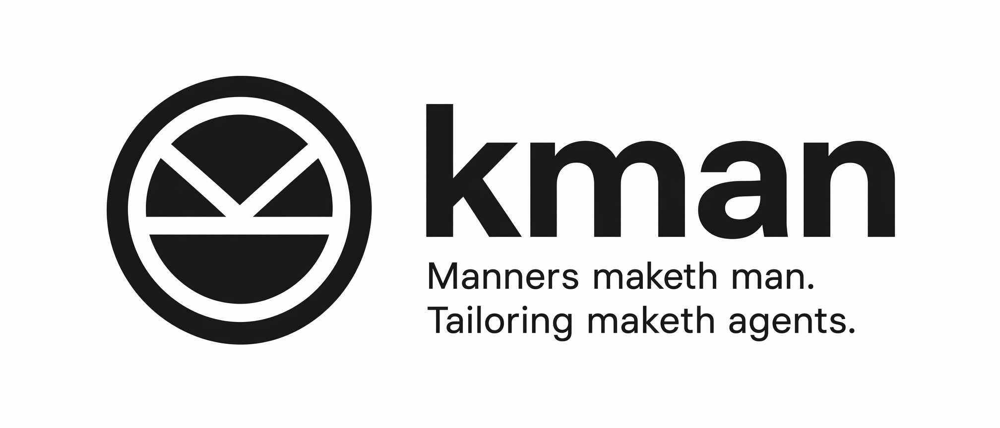

<p align="center"></p>

<p align="center"><strong>English</strong> · <a href="README.zh-CN.md">简体中文</a></p>

> Multi-agent management tool, *name is inspired by [Kingsman](https://en.wikipedia.org/wiki/Kingsman:_The_Secret_Service)* — a small society of named, well-tailored agents you can dispatch on a mission.

`kman` gives each named agent its own isolated directory, soul prompt, skills, hooks, and MCP servers, and runs it on the embedded **pi** agent runtime by default — or *above* an external runtime (Claude Code, GitHub Copilot CLI, …) when you select one. One CLI dispatches them all while keeping each agent's files separate and portable.

See the [docs](docs/README.md) for the architecture and full usage guide, or jump straight to the published CLI: **[`@unliftedq/kman`](apps/cli/README.md)**.

## Why kman?

Modern agent runtimes (Claude Code, Copilot CLI, …) keep growing in capability: more skills, more MCP servers, more hooks, more tools. Piling all of that into a single, general-purpose configuration quickly stops scaling — both for the model and for the human driving it. kman's answer is **agent-level isolation**, in the spirit of [Agent-Level Isolation for AI Agents](https://wangqiao.me/posts/agent-level-isolation-for-ai-agents/): instead of one omniscient assistant, run a small society of narrow, well-tailored agents — `orchestrator`, `developer`, `researcher`, … — and dispatch the right one for the mission.

Concretely, that buys you:

- **Context isolation, not skill bloat.** Each agent only sees its own `~/.kman/agents/<name>/` directory — its own skills, hooks, MCP servers, and soul prompt. Skills are *not* eagerly merged into one giant catalog shared by every session, so a `coder` agent doesn't pay tokens for a `researcher`'s web-scraping skills, and vice versa. Smaller context → cheaper runs, faster responses, fewer "lost in the middle" failures.
- **Focus by construction.** An agent is defined by a single soul prompt plus a curated set of skills/tools. Because the surface area is intentionally narrow, the model is biased toward what it's actually good at instead of negotiating between dozens of half-relevant capabilities. You get specialists (`coder`, `reviewer`, `researcher`, `release-bot`, …) rather than one overworked generalist.
- **Blast-radius isolation.** Permissions, MCP servers, and hooks are scoped per agent, not global. A `researcher` that browses the open web doesn't share credentials or write-access with a `release-bot` that can push tags. Misbehavior — accidental `rm -rf`, prompt injection from a fetched page, an over-eager tool call — is contained to the agent that was dispatched, not your whole toolchain.
- **Backend-agnostic, profile-portable.** By default agents run on the embedded `pi` runtime (shipped as part of kman, no external CLI to install), and the same named agent profile also runs on top of `claude-code` and `copilot-cli`, with `codex` / `gemini` adapters tractable as future work. You isolate *the agent*, not *the vendor*: switching backends doesn't mean re-curating skills, hooks, and prompts from scratch.
- **Reproducible and shareable.** Because every agent is just a directory of plain data, agents are versionable, diffable, and shareable. Teams can ship a `frontend-reviewer` the same way they ship a linter config, instead of passing around a 3-page system prompt in Notion.
- **Composable instead of monolithic.** v1 keeps cross-agent composition simple — shell pipes between `kman run --agent ...` invocations — but the isolation boundary is the same one future multi-agent flows, desktop UIs, and remote gateways will build on. You don't have to re-architect later to get sub-agent delegation; the agents are already separate citizens.

In short: **don't build one giant agent that knows everything. Build many small agents that each know one thing well, and let kman dispatch them.**

## How it works

Every agent lives at `~/.kman/agents/<name>/` as a self-contained directory of agent data: a `soul.md` (the agent's character), an `agent.toml` profile (runtime, model, permissions), and per-agent skills, hooks, and MCP servers. At launch kman prepares the selected agent for the chosen runtime and passes the soul through the runtime's native agent mechanism, so it arrives as a real system prompt instead of an ad-hoc user message.

## Example agents

Curious what a kman-managed agent actually looks like? See **[unliftedq/agents](https://github.com/unliftedq/agents)** — a curated collection of portable, domain-focused agents built to run with kman. Each agent is a self-contained folder that captures its persona, skills, tools, and permissions:

```
<agent>/
  agent.toml      # name, description, runtime, soul reference, and defaults
  soul.md         # the agent's persona / system prompt
  mcp.json        # MCP server configuration, if any
  skills/         # this agent's domain skills, each containing SKILL.md
  hooks/          # hooks owned by this agent
  scripts/        # helper scripts owned by this agent
```

Browse the repo for concrete examples you can copy, adapt, or dispatch directly via `kman -a <name> run`.

## Status

| Backend | Status | Notes |
|---|---|---|
| `pi` | ✅ supported (default) | embedded SDK (`@earendil-works/pi-coding-agent`); no external CLI required |
| `claude-code` | ✅ supported | requires `claude` on PATH (or `KMAN_CLAUDE_BIN`) |
| `copilot-cli` | ✅ supported | requires `copilot` on PATH (or `KMAN_COPILOT_BIN`) |
| `codex` / `gemini` | future | not implemented |

Pre-1.0. Layout and flag surface may still change.

## Quick start (dev)

```bash
bun install
bun run kman --help
bun run kman agent create coder            # embedded pi runtime by default
bun run kman agent create reviewer --runtime claude-code
bun run kman -a coder run --task "Refactor the auth module."
```

For end-user install via npm, see [`apps/cli/README.md`](apps/cli/README.md).

## Cross-agent dispatch via MCP

Every `kman run` / `kman chat` automatically injects a kman MCP server into the spawned backend, so the running agent can discover and call its peers as MCP tools (`kman_list_agents`, `kman_describe_agent`, `kman_run_agent`). External runtimes can opt in directly:

```bash
kman mcp install claude-code     # writes user-scope ~/.claude.json
kman mcp install copilot-cli     # writes user-scope ~/.copilot/mcp-config.json
kman mcp config                  # prints the JSON snippet for any other host
```

Cycle protection lives in the daemon: it walks each task's parent links to reject `a → b → a` loops (and self-delegation), capping depth at 8. See [docs/multi-agent.md](docs/multi-agent.md).

## Layout

```
.
├── apps/cli                       # @unliftedq/kman — the published CLI (binary: kman)
├── packages/                      # all internal, all private (not published)
│   ├── types                      # @kman/types — shared interfaces
│   ├── core                       # @kman/core — profile, context, prompt, launcher, doctor
│   ├── daemon                     # @kman/daemon — resident task daemon, scheduler, IPC, OS hosts
│   ├── skills                     # @kman/skills — fetch + vendor SKILL.md sources
│   ├── backend-base               # @kman/backend-base — spawn helpers
│   ├── backend-pi                 # @kman/backend-pi — embedded pi SDK runtime (default)
│   ├── backend-claude-code        # @kman/backend-claude-code
│   ├── backend-copilot-cli        # @kman/backend-copilot-cli
│   └── mcp-server                 # @kman/mcp-server — exposes the agent roster as an MCP server
├── scripts/                       # one-shot migration helpers
└── docs/                          # documentation (start at docs/README.md)
```

## Toolchain

- Bun ≥ 1.2
- TypeScript 5.9
- Turborepo 2.x
- commander 14.x

## License

Apache-2.0 — see [LICENSE](LICENSE).
