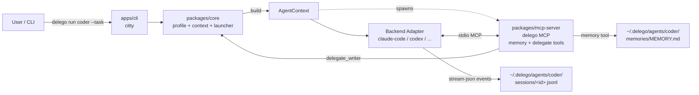
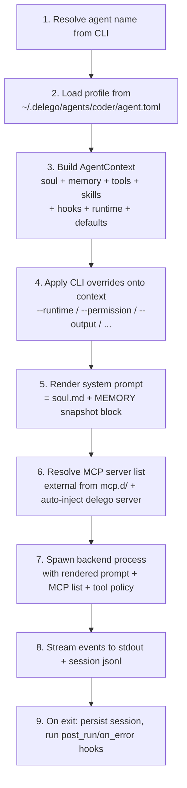

# Delego — Design Document

> A multi-agent orchestration engine. v1 ships as a CLI; future surfaces (desktop / web / gateway) reuse the same core.

---

## 1. Vision

Delego is **not** another agent runtime. It is an **orchestrator** that sits above existing CLI agents (`claude-code`, `codex`, `copilot-cli`, `gemini`, ...) and gives them four things they currently lack as a system:

1. **Named agent profiles** — each agent has its own soul, memory, skills, tools, and default runtime, addressable by name.
2. **Unified memory** — a bounded, agent-curated `MEMORY.md` per agent, surviving across sessions and across backends.
3. **Frictionless multi-agent composition** — any agent can call any other agent through a generated MCP server, with no backend-specific glue.
4. **Backend-agnostic CLI** — one set of commands, one profile format, one session log, regardless of which underlying CLI agent does the work.

Long-term, the same core powers a desktop app, a web UI, and a remote gateway. v1 deliberately ships only the CLI.

---

## 2. Non-Goals (v1)

- **No own LLM runtime.** Delego never calls an LLM API directly. All inference happens inside the chosen backend.
- **No workflow DSL.** No `delego flow` command, no YAML pipelines. Multi-agent orchestration in v1 is either (a) shell composition / pipes, or (b) one agent calling another via the auto-injected MCP server.
- **No vector memory / RAG.** External memory providers (`mem0`, `honcho`, ...) are deferred. v1 ships only the bounded `MEMORY.md` model.
- **No project-local profiles.** All agents live at `~/.delego/`. No `.delego/` in repos.
- **No skill template system.** New agents start with an empty skills directory.
- **No `USER.md`.** Only `MEMORY.md` per agent in v1.

---

## 3. Architecture

### 3.1 High-level



### 3.2 The `AgentContext` — pipeline center

Every `delego run` invocation builds an immutable `AgentContext` object **before** the backend is spawned. All downstream components — backend launcher, MCP server, hook runner, session writer — read from this single source of truth.



CLI overrides act on the **context**, not on the raw profile. Profile stays immutable on disk.

### 3.3 Backend adapter interface

Each backend lives in its own package (`packages/backend-<name>/`). Adapters implement a common `Backend` interface:

```ts
interface Backend {
  readonly name: string;
  readonly capabilities: BackendCapabilities;

  /** Spawn a one-shot run, returning a stream of normalized events. */
  spawn(ctx: AgentContext, opts: RunOptions): AsyncIterable<DelegoEvent>;

  /** Spawn an interactive REPL, passing stdin/stdout through transparently. */
  chat(ctx: AgentContext, opts: ChatOptions): Promise<ChildProcess>;

  /** Map abstract permission level to backend-native mode. */
  mapPermission(level: 'ask' | 'auto' | 'yolo'): string;

  /** How to resume — native session id, transcript replay, or unsupported. */
  resumeStrategy: 'native' | 'replay' | 'unsupported';
}

interface BackendCapabilities {
  supportsResume: boolean;
  supportsMcp: boolean;
  supportsStreamJson: boolean;
  supportsAppendSystemPrompt: boolean;
}
```

Normalized event shape (what backends produce, what `--output stream-json` emits):

```ts
type DelegoEvent =
  | { type: 'message'; role: 'assistant' | 'user'; content: string; ts: string }
  | { type: 'tool_use'; tool: string; input: unknown; ts: string }
  | { type: 'tool_result'; tool: string; output: unknown; ts: string; ok: boolean }
  | { type: 'usage'; turns: number; input_tokens: number; output_tokens: number; cost_usd?: number }
  | { type: 'error'; message: string; recoverable: boolean }
  | { type: 'end'; reason: 'completed' | 'aborted' | 'error'; session_id: string };
```

### 3.4 The `delego` MCP server (in-process or standalone)

A single TypeScript implementation in `packages/mcp-server/` powers both:

- **In-process per-run mode** — spawned as a stdio MCP server child of each `delego run`, bound to that agent's context. The backend sees one extra MCP server named `delego`.
- **Standalone mode** — `delego mcp serve` runs the same code as a long-lived process for IDE / external integrations.

Tools exposed:

| Tool | Action | Scope |
|---|---|---|
| `memory` | `add(content)` / `replace(old_text, content)` / `remove(old_text)` | Bound to **this agent's** `MEMORY.md`. No `agent_id` param — identity is baked in at server launch. No `read` action — snapshot already in system prompt. |
| `delegate_<peer>` | `(task: string, options?)` — invokes another agent | One tool per known peer agent (C2 granularity). The calling agent is excluded from the catalog to prevent self-loops. |

Memory tool implementation rules (Hermes-compatible):

- Substring matching for `old_text` in `replace` / `remove`.
- `char_limit` enforced atomically; over-limit returns error with current usage.
- Exact-duplicate `add` rejected silently with success.
- Entries scanned for prompt-injection / credential-exfil / invisible-unicode patterns before accept.
- Persisted to disk immediately; system-prompt snapshot is **frozen** for current session (prefix-cache friendly).

---

## 4. Storage Layout

```
~/.delego/
├── mcp.d/                              # 13: global MCP server registry
│   ├── github.toml
│   └── playwright.toml
└── agents/
    └── coder/                          # 2: agent profile (global only)
        ├── agent.toml                  # 4: TOML profile
        ├── soul.md                     # 5: system prompt
        ├── memories/
        │   └── MEMORY.md               # 9: per-agent, MEMORY.md only
        ├── skills/                     # 12: per-agent vendored
        │   └── humanizer/
        │       ├── SKILL.md
        │       ├── .delego-skill.json  # source/version manifest
        │       └── ...
        ├── hooks/                      # 19: script hook bodies live here
        │   ├── pre-run-check.sh
        │   └── notify.py
        ├── sessions/                   # 17: unified jsonl session log
        │   ├── index.db                # sqlite FTS5 for search
        │   ├── 20260525-091247-abc123.jsonl
        │   └── ...
        └── logs/
            └── agent.log               # delego-side diagnostic log (separate from session events)
```

Secrets never live in TOML. `env_from = [...]` reads from shell env; `env_from_keyring = [...]` reads from OS keyring (macOS Keychain / Windows Credential Manager / libsecret).

---

## 5. Profile Schema

### 5.1 `~/.delego/agents/<name>/agent.toml`

```toml
name        = "coder"
description = "Senior backend engineer agent"

[runtime]
default = "claude-code"                  # any registered backend
model   = "claude-sonnet-4.5"            # passed to backend; backend default if omitted

[soul]
prompt_file = "soul.md"                  # relative to agent dir

[memory]
enabled    = true                        # toggleable (delego agent memory enable/disable)
char_limit = 2200                        # ~800 tokens, Hermes default
provider   = ""                          # placeholder for v2 external providers

[skills]
enabled = ["humanizer", "test-driven-development"]
                                          # references to vendored dirs under skills/

[tools]
# unified entry. MCP entries reference a server in ~/.delego/mcp.d/
github     = { type = "mcp", server = "github" }                          # all tools of that server
playwright = { type = "mcp", server = "playwright", include = ["navigate", "screenshot"] }
weather    = { type = "shell", cmd = "curl wttr.in/{city}" }
deploy_api = { type = "http",  url = "https://api.internal/deploy", method = "POST" }

[hooks]
pre_run          = [{ command = "git pull --rebase" }, { script = "hooks/check-env.sh" }]
post_run         = [{ script  = "hooks/notify.py", on_success_only = true }]
on_error         = [{ command = "notify-send 'agent crashed'" }]
pre_memory_write = [{ script  = "hooks/redact.py" }]

[defaults]
max_turns       = 50
permission_mode = "ask"                   # ask | auto | yolo
output_format   = "text"                  # text | json | stream-json

# Optional: backend-specific escape hatches
[runtime.claude-code]
permission_mode_raw = "plan"              # bypasses abstract mapping for this backend
extra_args = ["--include-partial-messages"]

[runtime.codex]
extra_args = ["--full-auto"]
```

### 5.2 `~/.delego/mcp.d/<name>.toml`

```toml
type    = "stdio"                         # stdio | sse | streamable-http
command = "npx"
args    = ["@modelcontextprotocol/server-github"]

env = { LOG_LEVEL = "info" }              # non-sensitive
env_from         = ["HTTPS_PROXY"]        # read from shell env
env_from_keyring = ["GITHUB_TOKEN"]       # read from OS keyring

# For HTTP/SSE servers
# url = "https://example.com/mcp"
# headers_from_keyring = ["AUTH_HEADER"]
```

### 5.3 Vendored skill manifest — `<agent>/skills/<skill>/.delego-skill.json`

```json
{
  "source": "agentskills:humanizer",
  "source_url": "https://agentskills.io/skills/humanizer@v1.3.2",
  "installed_at": "2026-05-25T09:12:47Z",
  "version": "git-sha-abc123",
  "checksum": "sha256:..."
}
```

`detach` removes this manifest (skill becomes pure local). `update` refuses if local mtime > manifest install time (use `--force` or detach first).

---

## 6. CLI Reference

All commands follow strict noun-verb grammar (Decision 1). No dynamic agent-as-subcommand.

### 6.1 Agent lifecycle

```bash
delego agent create <name> [flags]
  --runtime <backend>          # default backend (claude-code, codex, copilot-cli, gemini)
  --model <id>                 # default model
  --memory / --no-memory       # default: --memory
  --description "<text>"
  --soul <path>                # seed soul.md from file (else opens $EDITOR)

delego agent list                                       # all agents
delego agent show <name>                                # profile + paths
delego agent delete <name> [--yes]
delego agent rename <old> <new>
delego agent edit <name>                                # opens agent.toml in $EDITOR
delego agent soul edit <name>                           # opens soul.md
```

### 6.2 Memory

```bash
delego agent memory enable  <name>
delego agent memory disable <name>
delego agent memory show    <name>                      # cat MEMORY.md with usage header
delego agent memory edit    <name>
delego agent memory clear   <name> [--yes]
```

### 6.3 Skills

```bash
delego agent skill add    <agent> <source>
  # <source> heuristics:
  #   ./local-path                  → local
  #   humanizer                      → agentskills.io
  #   agentskills:humanizer          → explicit registry
  #   github:user/repo[/path]        → GitHub
  #   https://...git[#ref]           → arbitrary git (v1: no ref pinning)
delego agent skill remove <agent> <skill>
delego agent skill list   <agent>
delego agent skill show   <agent> <skill>
delego agent skill update <agent> <skill> [--force]
delego agent skill update <agent> --all
delego agent skill detach <agent> <skill>               # remove manifest, treat as local-only
delego agent skill fork   <agent> <skill> <new-name>    # copy for local modification
```

### 6.4 Tools (entries in agent profile)

```bash
delego agent tool add    <agent> <name> --type mcp --server <mcp-name> [--include tool1,tool2]
delego agent tool add    <agent> <name> --type shell --cmd "..."
delego agent tool add    <agent> <name> --type http --url "..." [--method POST]
delego agent tool remove <agent> <name>
delego agent tool list   <agent>
```

### 6.5 MCP server registry (global)

```bash
delego mcp add <name>
  --type stdio --command "npx" --args "@modelcontextprotocol/server-github"
  --env-from GITHUB_TOKEN
  --env-from-keyring ANTHROPIC_API_KEY
delego mcp add <name> --type sse --url "..." --header-from-keyring AUTH_HEADER
delego mcp list
delego mcp show   <name>
delego mcp remove <name>
delego mcp test   <name>                                # spawn it, list its tools, exit
delego mcp serve                                         # run the delego MCP server standalone
```

### 6.6 Hooks

```bash
delego agent hook list   <agent>
delego agent hook add    <agent> <event> --command "..."
delego agent hook add    <agent> <event> --script hooks/foo.sh [--on-success-only]
delego agent hook remove <agent> <event> <index>
delego agent hook test   <agent> <event>                # print stdin payload that would be sent
```

Events (v1): `pre_run` | `post_run` | `on_error` | `pre_memory_write`.

### 6.7 Run / chat

```bash
delego run <agent> --task "..." [flags]
  --runtime <backend>                # override profile default
  --model <id>                       # override
  --permission ask|auto|yolo         # abstract level
  --runtime-flag key=value           # raw escape hatch
  --output text|json|stream-json     # default text
  --stream                           # implies --output stream-json if not set
  --resume [<id>]                    # resume most recent or specific
  --no-memory                        # disable memory for this run only
  --cwd <path>                       # working directory for backend

delego chat <agent> [--runtime <backend>] [--resume [<id>]]
```

Exit codes:

| Code | Meaning |
|---|---|
| 0 | success |
| 1 | agent error (LLM/tool/backend reported) |
| 2 | user error (bad CLI args, missing profile) |
| 3 | hook aborted run (pre_run non-zero) |
| 4 | backend not installed or unreachable |
| 130 | interrupted (SIGINT) |

### 6.8 Sessions

```bash
delego sessions list   <agent> [--limit N] [--since <date>]
delego sessions show   <agent> <id> [--format text|json]
delego sessions search <agent> <query>                  # FTS5 over event content
delego sessions prune  <agent> [--keep N] [--older-than <duration>]
delego sessions export <agent> <id> --to <path>
```

### 6.9 Config / diagnostics

```bash
delego config show                                        # global config
delego config set <key> <value>
delego doctor                                             # check backend installs, MCP servers, keyring
delego version
delego --help
```

---

## 7. Multi-Agent Composition

### v1 (programmatic + pipe)

```bash
# Pipe (linear, text)
delego run extractor --task "extract requirements from spec.md" \
  | delego run designer --task "design API given these requirements" \
  | delego run coder --task "implement the API"

# Programmatic (structured)
PLAN=$(delego run planner --task "$1" --output json)
delego run coder --task "$(echo $PLAN | jq -r .step1)"
delego run tester --task "$(echo $PLAN | jq -r .step2)"
```

### v2 (sub-agent via auto-injected MCP)

When agent `coder` runs, its `delego` MCP server exposes `delegate_writer`, `delegate_reviewer`, ... — one tool per other registered agent. The coder agent itself decides when to invoke them inside its own loop.

```
delego run orchestrator --task "implement and test the auth feature"
  └─ orchestrator's LLM, seeing delegate_coder and delegate_tester in its toolbox, autonomously:
       1. delegate_coder(task="write the auth handler")
       2. delegate_tester(task="write integration tests")
```

The MCP `delegate_<peer>` tool internally calls `delego run <peer> --task ... --output json` and returns the parsed result. Sub-runs get their own session id, their own MEMORY.md, their own logs. Depth limit and circular-call protection enforced in `packages/mcp-server/`.

---

## 8. Repo Layout

```
delego/
├── apps/
│   ├── cli/                          # @delego/cli — the only v1 app
│   │   ├── src/
│   │   │   ├── main.ts               # citty entry
│   │   │   └── commands/             # one file per command group
│   │   │       ├── agent.ts          # agent {create,list,show,delete,...}
│   │   │       ├── memory.ts
│   │   │       ├── skill.ts
│   │   │       ├── tool.ts
│   │   │       ├── mcp.ts
│   │   │       ├── hook.ts
│   │   │       ├── run.ts
│   │   │       ├── chat.ts
│   │   │       ├── sessions.ts
│   │   │       └── config.ts
│   │   └── package.json
│   ├── desktop/                      # placeholder (empty)
│   ├── web/                          # placeholder (empty)
│   └── gateway/                      # placeholder (empty)
├── packages/
│   ├── types/                        # @delego/types — lingua franca
│   │   └── src/
│   │       ├── profile.ts            # Profile, MemoryConfig, ToolEntry, ...
│   │       ├── context.ts            # AgentContext
│   │       ├── events.ts             # DelegoEvent (normalized stream)
│   │       ├── backend.ts            # Backend interface + Capabilities
│   │       └── index.ts
│   ├── core/                         # @delego/core
│   │   └── src/
│   │       ├── profile/              # TOML read/write/validate
│   │       ├── context/              # AgentContext builder
│   │       ├── secrets/              # env + keyring bridge
│   │       ├── launcher/             # spawns backend, manages lifecycle, streams events
│   │       ├── sessions/             # jsonl writer + sqlite FTS5 index
│   │       ├── hooks/                # hook runner
│   │       └── prompt/               # render soul + memory snapshot
│   ├── mcp-server/                   # @delego/mcp-server (the delego MCP server)
│   │   └── src/
│   │       ├── server.ts             # MCP server bootstrap (stdio)
│   │       ├── tools/
│   │       │   ├── memory.ts         # add/replace/remove
│   │       │   └── delegate.ts       # delegate_<peer> generator
│   │       └── modes/
│   │           ├── embedded.ts       # in-process per-run mode
│   │           └── standalone.ts     # `delego mcp serve` mode
│   ├── skills/                       # @delego/skills
│   │   └── src/
│   │       ├── source-resolver.ts    # local / agentskills.io / github
│   │       ├── vendor.ts             # copy + write manifest
│   │       ├── manifest.ts           # .delego-skill.json
│   │       └── update.ts             # diff + conflict detection
│   ├── backend-base/                 # @delego/backend-base — interface + shared helpers
│   │   └── src/
│   │       ├── backend.ts            # re-export Backend type
│   │       └── stream-parser.ts      # generic stream-json -> DelegoEvent
│   ├── backend-claude-code/
│   ├── backend-codex/
│   ├── backend-copilot-cli/
│   └── backend-gemini/
├── docs/
│   └── DESIGN.md                     # this file
├── turbo.json
├── package.json                      # workspace root
├── bun.lockb
└── tsconfig.base.json
```

---

## 9. Distribution

### 9.1 Developer install (Bun users)

```bash
bun install -g @delego/cli
delego --help
```

### 9.2 End-user install (compiled binary)

`bun build --compile --target=bun-darwin-arm64 --outfile dist/delego-macos-arm64`
(plus linux-x64, linux-arm64, win-x64 in CI)

Published via GitHub Releases. Future: Homebrew tap, Scoop bucket, AUR.

### 9.3 Docker

`docker run -v $HOME/.delego:/root/.delego ghcr.io/<org>/delego run coder --task "..."`

(for CI / serverless invocations; deferred to post-v1)

---

## 10. Roadmap

| Milestone | Scope | Acceptance |
|---|---|---|
| **M1 — walking skeleton** | Monorepo bootstrapped. `delego --help` prints. `delego version` works. `delego agent create/list/show` works on disk (no backend integration). | `bun run delego agent create foo && bun run delego agent list` round-trips. |
| **M2 — single backend** | Claude-code adapter only. `delego run` end-to-end (one-shot + stream). Session jsonl written. | `delego run foo --task "say hi"` returns assistant text. `delego sessions show foo <id>` shows transcript. |
| **M3 — memory + skills** | `delego` MCP server embedded mode. Memory tool functional. Skill add/list/update for local and agentskills.io sources. | Agent can `memory.add` mid-session; next session sees it in system prompt. |
| **M4 — multi-backend** | Codex, copilot-cli, gemini adapters. Permission abstraction mapping. `--runtime` flag works. | Same agent profile produces same result across all four backends (modulo backend feature flags). |
| **M5 — multi-agent (v2)** | `delegate_<peer>` tools auto-injected. Depth/cycle protection. `delego mcp serve` standalone mode. | An "orchestrator" agent successfully invokes "coder" and "tester" sub-agents within one run. |
| **M6 — polish** | Compiled binary releases. Hooks. Resume across backends. `delego doctor`. FTS5 session search. | End-user `brew install delego` works on macOS. |

v3 (workflow DSL, external memory providers, desktop/web/gateway) explicitly out of scope.

---

## 11. Open Risks

1. **Backend stability** — claude-code / codex / gemini-cli all change their CLI surface every few weeks. Adapter packages will need active maintenance. Each adapter pins minimum required version and probes capabilities at startup.
2. **MCP `delegate_<peer>` recursion** — without protection, agent A can spawn agent B which spawns agent A again, indefinitely. Mitigation: `max_spawn_depth` (default 3), cycle detection via run-id chain.
3. **Skill update conflicts** — `.delego-skill.json` checksum diverging from current files indicates local edits. We refuse, require explicit `--force` or `detach`. Acceptable UX cost.
4. **Keyring portability** — Linux libsecret requires gnome-keyring or KeePassXC running. Headless servers may need fallback to `env_from`.
5. **`MEMORY.md` race on concurrent runs** — same agent run twice in parallel could race on memory writes. Mitigation: file lock (flock / proper-lockfile) around tool actions; reads always re-fetch from disk for non-snapshot operations.

---

## 12. Design Decision Index

| # | Decision | Reference |
|---|---|---|
| 1 | Strict noun-verb CLI grammar | §6 |
| 2 | Global-only agent storage (`~/.delego/agents/`) | §4 |
| 3 | Orchestrator mode (no own runtime), pluggable backends | §3.3 |
| 4 | TOML profile + standalone soul.md | §5.1 |
| 5 | `[tools]` unified entry; `type=mcp` references global `mcp.d/` | §5.1, §5.2 |
| 6 | MCP entries can `include` a tool subset | §5.1 |
| 7 | v1=programmatic+pipe; v2=sub-agent via MCP; no v3 workflow | §7 |
| 8 | Memory: Hermes-style bounded `MEMORY.md` only, no USER.md | §3.4, §5.1 |
| 9 | MCP topology: single `delego` server, instantiated per-run | §3.4 |
| 10 | `delegate_<peer>` granularity (one tool per peer) | §3.4, §7 |
| 11 | `AgentContext` is the pipeline center; CLI overrides act on it | §3.2 |
| 12 | Skills: per-agent vendored, single CLI family, manifest+detach | §5.3, §6.3 |
| 13 | MCP server config: global registry at `~/.delego/mcp.d/` | §5.2 |
| 14 | Secrets: shell env or OS keyring; never plaintext TOML | §5.2 |
| 15 | Three run modes: run / run --stream / chat | §6.7 |
| 16 | Output formats: text / json / stream-json | §6.7 |
| 17 | Unified jsonl session log, best-effort cross-backend resume | §6.8, §4 |
| 18 | Permission: abstract (ask/auto/yolo) + raw escape hatch | §6.7, §5.1 |
| 19 | Hooks: pre_run / post_run / on_error / pre_memory_write | §6.6 |
| 20 | TypeScript + Bun + Turborepo + citty | §8 |
