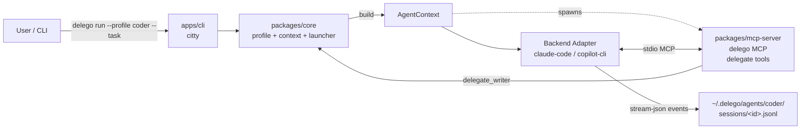
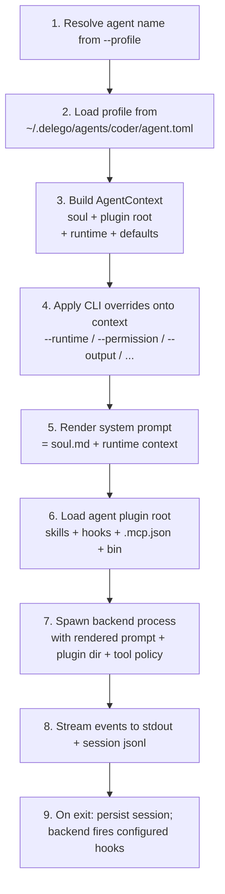

# Delego — Design Document

> A multi-agent orchestration engine. v1 ships as a CLI; future surfaces (desktop / web / gateway) reuse the same core.

---

## 1. Vision

Delego is **not** another agent runtime. It is an **orchestrator** that sits above existing CLI agents (`claude-code`, `copilot-cli`, and later `codex`, `gemini`, ...) and gives them three things they currently lack as a system:

1. **Named agent profiles** — each agent has its own soul, plugin files, and default runtime, addressable by name.
2. **Frictionless multi-agent composition** — any agent can call any other agent through a generated MCP server, with no backend-specific glue.
3. **Backend-agnostic CLI** — one set of commands, one profile format, one session log, regardless of which underlying CLI agent does the work.

Long-term, the same core powers a desktop app, a web UI, and a remote gateway. v1 deliberately ships only the CLI.

---

## 2. Non-Goals (v1)

- **No own LLM runtime.** Delego never calls an LLM API directly. All inference happens inside the chosen backend.
- **No workflow DSL.** No `delego flow` command, no YAML pipelines. Multi-agent orchestration in v1 is either (a) shell composition / pipes, or (b) one agent calling another via the auto-injected MCP server.
- **No project-local profiles.** All agents live at `~/.delego/`. No `.delego/` in repos.
- **No skill template system.** New agents start with an empty skills directory.
- **No shell / HTTP custom tools.** v1 only wires MCP tools. Shell and HTTP tool adapters need a separate schema, timeout, quoting, and safety design.
- **No Codex / Gemini adapters in v1.** v1 implements `claude-code` and `copilot-cli` first. Codex and Gemini wait until their plugin-loading adapter mechanisms are designed.
- **No config command in v1.** Global configuration commands are deferred until concrete global settings exist.

---

## 3. Architecture

### 3.1 High-level



### 3.2 The `AgentContext` — pipeline center

Every `delego run` invocation builds an immutable `AgentContext` object **before** the backend is spawned. All downstream components — backend launcher, MCP server, hook runner, session writer — read from this single source of truth.



CLI overrides act on the **context**, not on the raw profile. Profile stays immutable on disk.

Agent names are lowercase kebab-case: `^[a-z][a-z0-9-]{0,62}$`. Names are case-sensitive in CLI input and on disk.

### 3.3 Backend adapter interface

Each backend lives in its own package (`packages/backend-<name>/`). v1 ships `claude-code` and `copilot-cli` adapters. Codex and Gemini are deferred until their plugin-loading adapter mechanisms are designed. Adapters implement a common `Backend` interface:

```ts
interface Backend {
  readonly name: string;
  readonly capabilities: BackendCapabilities;

  /** Spawn a one-shot run, returning a stream of normalized events. */
  spawn(ctx: AgentContext, opts: RunOptions): AsyncIterable<DelegoEvent>;

  /** Spawn an interactive REPL, passing stdin/stdout through transparently. */
  chat(ctx: AgentContext, opts: ChatOptions): Promise<ChildProcess>;

  /** Map abstract permission level to backend-native mode. */
  mapPermission(level: 'ask' | 'auto' | 'yolo'): string;

  /** How to resume — native session id, transcript replay, or unsupported. */
  resumeStrategy: 'native' | 'replay' | 'unsupported';
}

interface BackendCapabilities {
  supportsResume: boolean;
  supportsMcp: boolean;
  supportsStreamJson: boolean;
  supportsAppendSystemPrompt: boolean;
}
```

Capability handling is fail-fast for required launch behavior: if a selected backend cannot accept the rendered system prompt or requested output mode, Delego exits with code 4 before spawning. If `supportsMcp = false`, Delego does not inject MCP servers; delegate tools are unavailable for that run and `delego doctor` reports the limitation.

Backend adapters receive the agent directory as the plugin root. For `claude-code` and `copilot-cli`, Delego passes that directory directly via the backend's `--plugin-dir` flag. Later adapters must either map the same plugin root into their native concepts or explicitly declare unsupported plugin features.

Normalized event shape (what backends produce, what `--output stream-json` emits):

```ts
type DelegoEvent =
  | { type: 'message'; role: 'assistant' | 'user'; content: string; ts: string }
  | { type: 'tool_use'; tool: string; input: unknown; ts: string }
  | { type: 'tool_result'; tool: string; output: unknown; ts: string; ok: boolean }
  | { type: 'usage'; turns: number; input_tokens: number; output_tokens: number; cost_usd?: number }
  | { type: 'error'; message: string; recoverable: boolean }
  | { type: 'end'; reason: 'completed' | 'aborted' | 'error'; session_id: string };
```

### 3.4 The `delego` MCP server (in-process or standalone)

A single TypeScript implementation in `packages/mcp-server/` powers both:

- **In-process per-run mode** — spawned as a stdio MCP server child of each `delego run`, bound to that agent's context. The backend sees one extra MCP server named `delego`.
- **Standalone mode** — the same server can run as a long-lived process for IDE / external integrations, bound to a selected agent by the launcher or host integration.

Tools exposed:

| Tool | Action | Scope |
|---|---|---|
| `delegate_<peer>` | `(task: string, options?)` — invokes another agent | One tool per known peer agent (C2 granularity). The calling agent is excluded from the catalog to prevent self-loops. |

Delegate tool names are derived from agent names by replacing `-` with `_`: `code-reviewer` becomes `delegate_code_reviewer`. Because `_` is not allowed in agent names, this mapping is collision-free.

---

## 4. Storage Layout

```
~/.delego/
└── agents/
  └── coder/                          # 2: agent profile (global only)
    ├── agent.toml                  # 4: TOML profile
    ├── soul.md                     # 5: system prompt
    ├── .mcp.json                   # 12: per-agent MCP server config
    ├── skills/                     # 11: per-agent vendored
    │   └── humanizer/
    │       ├── SKILL.md
    │       ├── .delego-skill.json  # source/version manifest
    │       └── ...
    ├── settings.json               # 18: plugin settings, including hooks
    ├── hooks/                      # per-agent hook scripts
    │   ├── check-env
    │   ├── notify
    │   └── session-end
    ├── bin/                        # executables exposed while plugin is enabled
    │   └── helper
    ├── sessions/                   # 16: unified jsonl session log
    │   ├── index.db                # sqlite FTS5 for search
    │   ├── 20260525-091247-abc123.jsonl
    │   └── ...
    └── logs/
      └── agent.log               # delego-side diagnostic log (separate from session events)
```

The agent directory is also the plugin root loaded by compatible backends:

| Path | Scope | Purpose |
|---|---|---|
| `skills/` | Plugin root | Skills as `<name>/SKILL.md` directories. |
| `settings.json` | Plugin root | Plugin settings, including hook event handlers. |
| `hooks/` | Plugin root | Per-agent hook scripts referenced by `settings.json`. |
| `.mcp.json` | Plugin root | MCP server configurations. |
| `bin/` | Plugin root | Executables added to backend-exposed Bash/shell tool execution and hook command `PATH` while the plugin is enabled. |

Secrets never live in `agent.toml`, `settings.json`, or `.mcp.json`. Secret values are supplied through the launch environment or backend-native secret handling, then referenced from plugin files without storing plaintext secrets.

`bin/` never mutates Delego's own process `PATH`; it only affects backend-exposed Bash/shell tool execution and hook commands while the plugin is enabled.

---

## 5. Profile Schema

### 5.1 `~/.delego/agents/<name>/agent.toml`

```toml
name        = "coder"
description = "Senior backend engineer agent"

[runtime]
default = "claude-code"                  # claude-code | copilot-cli in v1
model   = "claude-sonnet-4.5"            # passed to backend; backend default if omitted

[soul]
prompt_file = "soul.md"                  # relative to agent dir

[defaults]
max_turns       = 50
permission_mode = "ask"                   # ask | auto | yolo
output_format   = "text"                  # text | json | stream-json

# Optional: backend-specific escape hatches
[runtime.claude-code]
permission_mode_raw = "plan"              # bypasses abstract mapping for this backend
extra_args = ["--include-partial-messages"]

[runtime.copilot-cli]
extra_args = ["--some-native-flag"]
```

### 5.2 `~/.delego/agents/<name>/.mcp.json`

```json
{
  "mcpServers": {
    "github": {
      "command": "npx",
      "args": ["@modelcontextprotocol/server-github"],
      "env": { "LOG_LEVEL": "info", "GITHUB_TOKEN": "$GITHUB_TOKEN" }
    },
    "playwright": {
      "command": "npx",
      "args": ["@playwright/mcp"]
    }
  }
}
```

MCP configuration is per-agent and loaded from that agent's plugin root. `.mcp.json` uses the Claude Code project MCP config shape. Delego also auto-injects its internal `delego` MCP server for delegate tools when the backend supports MCP. The MCP server name `delego` is reserved; if `.mcp.json` defines that server name or any tool conflicts with generated `delegate_<peer>` tools, Delego exits with code 2 before spawning the backend. If `.mcp.json` references an invalid server or command shape, Delego exits with code 2 before spawning the backend.

### 5.3 `~/.delego/agents/<name>/settings.json`

```json
{
  "hooks": {
    "PreToolUse": [
      {
        "matcher": "Bash",
        "hooks": [{ "type": "command", "command": "hooks/check-env" }]
      }
    ],
    "PostToolUse": [
      {
        "matcher": "Edit|Write",
        "hooks": [{ "type": "command", "command": "hooks/notify" }]
      }
    ],
    "SessionEnd": [
      {
        "hooks": [{ "type": "command", "command": "hooks/session-end" }]
      }
    ]
  }
}
```

Hook configuration follows the existing Claude Code settings format: a top-level `hooks` object keyed by hook event name, where each event maps to matcher groups with `hooks` entries. Hook commands are resolved from the plugin root when relative. Per-agent hook scripts live under `hooks/`. `bin/` executables are added to backend-exposed Bash/shell tool execution and hook command `PATH` while the plugin is enabled.

### 5.4 Vendored skill manifest — `<agent>/skills/<skill>/.delego-skill.json`

```json
{
  "source": "agentskills:humanizer",
  "source_url": "https://agentskills.io/skills/humanizer@v1.3.2",
  "installed_at": "2026-05-25T09:12:47Z",
  "version": "git-sha-abc123",
  "checksum": "sha256:..."
}
```

`detach` removes this manifest (skill becomes pure local). `update` refuses if local mtime > manifest install time (use `--force` or detach first).

Installed skill directories are the source of truth. A skill is active when `<agent>/skills/<skill>/` exists. `agent.toml` does not duplicate the installed skill list. v1 installs skills by copying directly into the target agent's `skills/` directory; no canonical cache or symlink mode is used.

Skill source parsing follows the `vercel-labs/skills` model: parse the source first, then discover skill directories by finding `SKILL.md` files. Sources may be local paths, GitHub/GitLab URLs, GitHub shorthand (`owner/repo`, `owner/repo/path`, `owner/repo@skill`), direct git URLs, branch/ref selectors, or well-known skill endpoints. Subpaths must be sanitized so they cannot escape the cloned repository. Discovery checks direct skill paths first, then common skill roots such as `skills/`, `.agents/skills/`, `.claude/skills/`, and other agent-specific skills directories, and finally bounded recursive search.

When a source resolves to multiple skills and the user did not pass `--skill` or `--all`, Delego opens an interactive multi-select picker so the user can choose exactly which skills to install. Interactivity is detected with stdin/stdout TTY checks. In non-interactive mode, Delego exits with code 2 and prints the discovered skill names, instructing the user to pass one or more `--skill` options or `--all`.

---

## 6. CLI Reference

All commands follow strict noun-verb grammar (Decision 1). No dynamic agent-as-subcommand. Agent management commands may use positional agent names for readability; other user-provided values are passed through options.

Agent-scoped commands select the target agent with the global `-p, --profile <agent>` option. `--profile` is accepted before or after subcommands. If `--profile` appears more than once, Delego exits with code 2. Agent-scoped commands require `--profile`; non-agent commands reject it unless explicitly documented.

```bash
delego skills list --profile coder
delego -p coder skills list
delego --profile coder sessions list
```

### 6.1 Agent lifecycle

```bash
delego agent create coder [flags]
  --runtime <backend>          # default backend (claude-code, copilot-cli)
  --model <id>                 # default model
  --description "<text>"
  --soul "<text>"              

delego agent list                                       # all agents
delego agent show coder                          # profile + paths
delego agent delete coder [--yes]
delego agent rename coder reviewer
```

### 6.2 Skills

```bash
delego skills add --profile coder --source vercel-labs/agent-skills
delego skills add --profile coder --source vercel-labs/agent-skills --skill humanizer
delego skills add --profile coder --source vercel-labs/agent-skills --all
delego skills list   --profile coder
delego skills show   --profile coder --skill humanizer
delego skills update --profile coder --skill humanizer [--force]
delego skills update --profile coder --all
delego skills remove --profile coder --skill humanizer
```

`skills add` discovers all candidate `SKILL.md` directories from `--source`. If there is exactly one candidate, it installs it. If there are multiple candidates, `--skill` filters by skill name, `--all` installs every candidate, and the interactive picker is used only when neither option is provided.

### 6.3 Plugin files

Delego does not provide `mcp` or `hook` subcommands. Users edit plugin files directly:

- `~/.delego/agents/<name>/.mcp.json` for per-agent MCP servers.
- `~/.delego/agents/<name>/settings.json` for hook configuration.
- `~/.delego/agents/<name>/hooks/` for hook scripts referenced by `settings.json`.

Hook events follow the backend hook system. For Claude-compatible backends, `settings.json` uses the same shape as Claude Code hooks, including events such as `PreToolUse`, `PostToolUse`, `Notification`, `SessionStart`, and `SessionEnd`.

### 6.4 Run / chat

```bash
delego run --profile coder --task "..." [flags]
  --runtime <backend>                # override profile default
  --model <id>                       # override
  --permission ask|auto|yolo         # abstract level
  --runtime-flag key=value           # raw escape hatch
  --output text|json|stream-json     # default text
  --stream                           # implies --output stream-json if not set
  --resume [<id>]                    # resume a specific session when id is supplied
  --continue                         # resume latest session for this profile
  --cwd <path>                       # working directory for backend

delego chat --profile coder [--runtime <backend>] [--resume [<id>] | --continue]
```

`--continue` is the canonical latest-session form. `--resume <id>` resumes a specific session. If `--resume` is provided without an id, it behaves like `--continue`.

Exit codes:

| Code | Meaning |
|---|---|
| 0 | success |
| 1 | agent error (LLM/tool/backend reported) |
| 2 | user error (bad CLI args, missing profile) |
| 3 | hook blocked execution |
| 4 | backend not installed or unreachable |
| 130 | interrupted (SIGINT) |

### 6.5 Sessions

```bash
delego sessions list   --profile coder [--limit N] [--since <date>]
delego sessions show   --profile coder --id 20260525-091247-abc123 [--format text|json]
delego sessions search --profile coder --query "auth bug"            # FTS5 over event content
delego sessions prune  --profile coder [--keep N] [--older-than <duration>]
delego sessions export --profile coder --id 20260525-091247-abc123 --to <path>
```

Each session is one JSONL file. Every line is a normalized `DelegoEvent`. The latest session is the newest completed or interrupted session for the same profile, ordered by the timestamp prefix in the session id. FTS5 indexes are derived data and may be rebuilt from JSONL files.

### 6.6 Diagnostics

```bash
delego doctor                                             # check backend installs, MCP servers, credentials
delego version
delego --help
```

---

## 7. Multi-Agent Composition

### v1 (programmatic + pipe)

```bash
# Pipe (linear, text)
delego run --profile extractor --task "extract requirements from spec.md" \
  | delego run --profile designer --task "design API given these requirements" \
  | delego run --profile coder --task "implement the API"

# Programmatic (structured)
PLAN=$(delego run --profile planner --task "$1" --output json)
delego run --profile coder --task "$(echo $PLAN | jq -r .step1)"
delego run --profile tester --task "$(echo $PLAN | jq -r .step2)"
```

### v2 (sub-agent via auto-injected MCP)

When agent `coder` runs, its `delego` MCP server exposes `delegate_writer`, `delegate_reviewer`, ... — one tool per other registered agent. The coder agent itself decides when to invoke them inside its own loop.

```
delego run --profile orchestrator --task "implement and test the auth feature"
  └─ orchestrator's LLM, seeing delegate_coder and delegate_tester in its toolbox, autonomously:
       1. delegate_coder(task="write the auth handler")
       2. delegate_tester(task="write integration tests")
```

The MCP `delegate_<peer>` tool internally calls `delego run --profile <peer> --task ... --output json` and returns the parsed result. Sub-runs get their own session id and logs. Depth limit and circular-call protection enforced in `packages/mcp-server/`.

---

## 8. Planned Repo Layout

This is the intended implementation layout, not the current repository state.

```
delego/
├── apps/
│   ├── cli/                          # @delego/cli — the only v1 app
│   │   ├── src/
│   │   │   ├── main.ts               # citty entry
│   │   │   └── commands/             # one file per command group
│   │   │       ├── agent.ts          # agent {create,list,show,delete,...}
│   │   │       ├── skill.ts
│   │   │       ├── run.ts
│   │   │       ├── chat.ts
│   │   │       └── sessions.ts
│   │   └── package.json
│   ├── desktop/                      # placeholder (empty)
│   ├── web/                          # placeholder (empty)
│   └── gateway/                      # placeholder (empty)
├── packages/
│   ├── types/                        # @delego/types — lingua franca
│   │   └── src/
│   │       ├── profile.ts            # Profile, RuntimeConfig, DefaultsConfig, ...
│   │       ├── context.ts            # AgentContext
│   │       ├── events.ts             # DelegoEvent (normalized stream)
│   │       ├── backend.ts            # Backend interface + Capabilities
│   │       └── index.ts
│   ├── core/                         # @delego/core
│   │   └── src/
│   │       ├── profile/              # TOML read/write/validate
│   │       ├── context/              # AgentContext builder
│   │       ├── secrets/              # launch env + credential helpers
│   │       ├── launcher/             # spawns backend, manages lifecycle, streams events
│   │       ├── sessions/             # jsonl writer + sqlite FTS5 index
│   │       ├── hooks/                # hook runner
│   │       └── prompt/               # render system prompt
│   ├── mcp-server/                   # @delego/mcp-server (the delego MCP server)
│   │   └── src/
│   │       ├── server.ts             # MCP server bootstrap (stdio)
│   │       ├── tools/
│   │       │   └── delegate.ts       # delegate_<peer> generator
│   │       └── modes/
│   │           ├── embedded.ts       # in-process per-run mode
│   │           └── standalone.ts     # long-lived MCP server mode for host integrations
│   ├── skills/                       # @delego/skills
│   │   └── src/
│   │       ├── source-parser.ts      # local / git / GitHub / GitLab / well-known sources
│   │       ├── discover.ts           # SKILL.md discovery + multi-skill selection candidates
│   │       ├── vendor.ts             # direct copy + write manifest
│   │       ├── manifest.ts           # .delego-skill.json
│   │       └── update.ts             # diff + conflict detection
│   ├── backend-base/                 # @delego/backend-base — interface + shared helpers
│   │   └── src/
│   │       ├── backend.ts            # re-export Backend type
│   │       └── stream-parser.ts      # generic stream-json -> DelegoEvent
│   ├── backend-claude-code/
│   └── backend-copilot-cli/
├── docs/
│   └── DESIGN.md                     # this file
├── turbo.json
├── package.json                      # workspace root
├── bun.lockb
└── tsconfig.base.json
```

---

## 9. Distribution

### 9.1 Developer install (Bun users)

```bash
bun install -g @delego/cli
delego --help
```

### 9.2 End-user install (compiled binary)

`bun build --compile --target=bun-darwin-arm64 --outfile dist/delego-macos-arm64`
(plus linux-x64, linux-arm64, win-x64 in CI)

Published via GitHub Releases. Future: Homebrew tap, Scoop bucket, AUR.

### 9.3 Docker

`docker run -v $HOME/.delego:/root/.delego ghcr.io/<org>/delego run --profile coder --task "..."`

(for CI / serverless invocations; deferred to post-v1)

---

## 10. Roadmap

| Milestone | Scope | Acceptance |
|---|---|---|
| **M1 — walking skeleton** | Monorepo bootstrapped. `delego --help` prints. `delego version` works. `delego agent create/list/show` works on disk (no backend integration). | `bun run delego agent create foo && bun run delego agent list` round-trips. |
| **M2 — single backend** | Claude-code adapter only. `delego run` end-to-end (one-shot + stream). Session jsonl written. | `delego run --profile foo --task "say hi"` returns assistant text. `delego sessions show --profile foo --id <id>` shows transcript. |
| **M3 — plugin root + MCP foundation** | Agent plugin root loads `skills/`, `settings.json`, `hooks/`, `.mcp.json`, and `bin/`. Skill add/list/update works for local, git, GitHub/GitLab, and well-known sources. | Agent can install from a source containing multiple skills by selecting skills interactively; manually edited per-agent MCP config loads during runs. |
| **M4 — backend parity** | Claude Code and Copilot CLI adapters. Permission abstraction mapping. `--runtime` flag works. | Same agent profile runs through both v1 backends (modulo backend feature flags). |
| **M5 — multi-agent (v2)** | `delegate_<peer>` tools auto-injected. Depth/cycle protection. Standalone MCP server mode for IDE/external integrations. | An "orchestrator" agent successfully invokes "coder" and "tester" sub-agents within one run. |
| **M6 — polish** | Compiled binary releases. Hooks. Resume across backends. `delego doctor`. FTS5 session search. | End-user `brew install delego` works on macOS. |

v3 (workflow DSL, desktop/web/gateway) explicitly out of scope.

---

## 11. Open Risks

1. **Backend stability** — claude-code and copilot-cli change their CLI surface over time. Adapter packages will need active maintenance. Each adapter pins minimum required version and probes capabilities at startup.
2. **MCP `delegate_<peer>` recursion** — without protection, agent A can spawn agent B which spawns agent A again, indefinitely. Mitigation: `max_spawn_depth` (default 3), cycle detection via run-id chain.
3. **Skill update conflicts** — `.delego-skill.json` checksum diverging from current files indicates local edits. We refuse, require explicit `--force` or `detach`. Acceptable UX cost.
4. **Secret availability** — MCP servers may require credentials in the launch environment. `delego doctor` should detect missing required env vars where possible, but backend-native secret handling can still fail at runtime.

---

## 12. Design Decision Index

| # | Decision | Reference |
|---|---|---|
| 1 | Strict noun-verb CLI grammar; agent management may use positional names, other values use options | §6 |
| 2 | Global-only agent storage (`~/.delego/agents/`) | §4 |
| 3 | Orchestrator mode (no own runtime), pluggable backends | §3.3 |
| 4 | TOML profile + standalone soul.md | §5.1 |
| 5 | `.mcp.json` is per-agent and follows the Claude Code project MCP config shape | §4, §5.2 |
| 6 | Reserved internal MCP server/tool names fail fast on conflict | §5.2 |
| 7 | v1=programmatic+pipe; v2=sub-agent via MCP; no v3 workflow | §7 |
| 8 | MCP topology: single `delego` server, instantiated per-run | §3.4 |
| 9 | `delegate_<peer>` granularity (one tool per peer) | §3.4, §7 |
| 10 | `AgentContext` is the pipeline center; CLI overrides act on it | §3.2 |
| 11 | Skills: direct-copy installed directories are the source of truth; source parsing follows SKILL.md discovery with interactive multi-select | §5.4, §6.2 |
| 12 | Plugin root: `skills/`, `settings.json`, `hooks/`, `.mcp.json`, `bin/` | §4 |
| 13 | Secrets: launch env or backend-native secret handling; never plaintext config files | §4, §5.2 |
| 14 | Three run modes: run / run --stream / chat; `--continue` resumes latest | §6.4 |
| 15 | Output formats: text / json / stream-json | §6.4 |
| 16 | Unified jsonl session log, rebuildable FTS5 index, best-effort cross-backend resume | §6.5, §4 |
| 17 | Permission: abstract (ask/auto/yolo) + raw escape hatch | §6.4, §5.1 |
| 18 | Hooks live in plugin-root `settings.json` using existing Claude Code hook settings format | §5.3, §6.3 |
| 19 | TypeScript + Bun + Turborepo + citty | §8 |
| 20 | Agent names are lowercase kebab-case; delegate tool names are derived collision-free | §3.2, §3.4 |
| 21 | Claude Code and Copilot CLI load the agent directory directly via `--plugin-dir` | §3.3 |
| 22 | No `config` command in v1 | §2, §6.6 |
