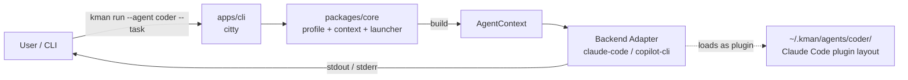
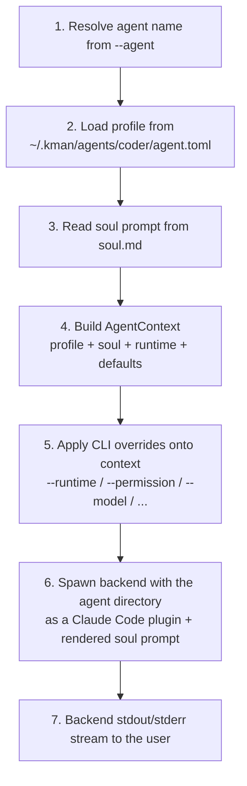

# kman — Design Document

> A multi-agent orchestration engine. v1 ships as a CLI; future surfaces (desktop / web / gateway) reuse the same core.

---

## 1. Vision

kman is **not** another agent runtime. It is an **orchestrator** that sits above existing CLI agents (`claude-code`, `copilot-cli`, and later `codex`, `gemini`, ...) and gives them three things they currently lack as a system:

1. **Named agent profiles** — each agent has its own soul, plugin files, and default runtime, addressable by name.
2. **Backend-agnostic CLI** — one set of commands, one profile format, regardless of which underlying CLI agent does the work.
3. **Claude Code plugin compatibility** — every kman agent directory is also a valid Claude Code plugin, so skills / hooks / MCP servers / commands written for the broader ecosystem work unchanged.

Long-term, the same core powers a desktop app, a web UI, and a remote gateway. v1 deliberately ships only the CLI.

---

## 2. Non-Goals (v1)

- **No own LLM runtime.** kman never calls an LLM API directly. All inference happens inside the chosen backend.
- **No workflow DSL.** No `kman flow` command, no YAML pipelines. Multi-agent orchestration in v1 is shell composition / pipes only.
- **No session management.** v1 relies entirely on each backend's native session storage and resume. kman does not capture, normalize, index, or search sessions, and ships no `sessions` subcommands. Cross-backend session UX is a [TODO](#10-roadmap).
- **No agent-to-agent invocation.** v1 does not run an in-process kman MCP server and does not auto-inject `delegate_<peer>` tools. Sub-agent composition is a [TODO](#10-roadmap).
- **No `doctor` command.** Environment / backend / plugin diagnostics are deferred. v1 fails fast at run time with actionable errors; a dedicated `kman doctor` is a [TODO](#10-roadmap).
- **No project-local profiles.** All agents live at `~/.kman/`. No `.kman/` in repos.
- **No skill template system.** New agents start with an empty skills directory.
- **No shell / HTTP custom tools.** v1 only wires MCP tools through `.mcp.json`. Shell / HTTP tool adapters need a separate schema, timeout, quoting, and safety design.
- **No Codex / Gemini adapters in v1.** v1 implements `claude-code` and `copilot-cli` first.
- **No config command in v1.** Global configuration commands are deferred until concrete global settings exist.
- **No compiled binary distribution in v1.** v1 ships as an npm package consumed via `bun install -g @kman/cli`. Single-file native binaries (Bun `--compile`), Homebrew / Scoop / AUR packaging, and Docker images are [TODO](#10-roadmap).

---

## 3. Architecture

### 3.1 High-level



kman does not interpose on the backend's I/O stream. Backend output (text, JSON, or backend-native stream) goes directly to the user's terminal. Session state stays inside the backend's own storage.

### 3.2 The `AgentContext` — pipeline center

Every `kman run` invocation builds an immutable `AgentContext` object **before** the backend is spawned. All downstream components — backend launcher, hook runner via the plugin — read from this single source of truth.



CLI overrides act on the **context**, not on the raw profile. Profile stays immutable on disk.

Agent names are lowercase kebab-case: `^[a-z][a-z0-9-]{0,62}$`. Names are case-sensitive in CLI input and on disk.

### 3.3 Backend adapter interface

Each backend lives in its own package (`packages/backend-<name>/`). v1 ships `claude-code` and `copilot-cli` adapters. Adapters implement a common `Backend` interface:

```ts
interface Backend {
  readonly name: string;
  readonly capabilities: BackendCapabilities;

  /** Spawn a one-shot run; stdout/stderr are passed through to the caller. */
  spawn(ctx: AgentContext, opts: RunOptions): Promise<ChildProcess>;

  /** Spawn an interactive REPL, passing stdin/stdout through transparently. */
  chat(ctx: AgentContext, opts: ChatOptions): Promise<ChildProcess>;

  /** Map abstract permission level to backend-native mode. */
  mapPermission(level: 'ask' | 'auto' | 'yolo'): string;
}

interface BackendCapabilities {
  /** Can load the agent directory as a Claude Code plugin via --plugin-dir. */
  supportClaudeCodePlugin: boolean;
  /** Can accept kman's rendered soul as an additional system prompt. */
  supportsAppendSystemPrompt: boolean;
  /** Exposes a native --resume / --continue style flag. */
  supportsNativeResume: boolean;
}
```

Capability handling is fail-fast for required launch behavior: if a selected backend cannot accept the rendered soul prompt, kman exits with code 4 before spawning.

For backends with `supportClaudeCodePlugin = true` (claude-code in v1), kman passes the agent directory directly via the backend's `--plugin-dir`. For other backends (copilot-cli, future codex/gemini), the adapter is responsible for translating the relevant subset of the plugin layout (skills, hooks, MCP servers) into the backend's native concepts, or declaring those features unsupported.

### 3.4 Multi-agent invocation (deferred — TODO)

v1 does not ship an in-process kman MCP server, `delegate_<peer>` tools, or any auto-injected delegation mechanism. Composing agents in v1 is done exclusively with shell pipes (§7).

The following are explicitly deferred:

- In-process per-run kman MCP server.
- One MCP tool per peer agent (`delegate_<peer>`), with depth and cycle protection via a `KMAN_RUN_CHAIN` env var.
- Standalone long-lived kman MCP server mode for IDE / external host integrations.

They are intentionally left out until backend stability and session strategy are settled.

---

## 4. Storage Layout

Every kman agent directory is a valid Claude Code plugin, following the [Claude Code plugin spec](https://code.claude.com/docs/en/plugins-reference). Backends that natively understand Claude Code plugins load the directory directly; other adapters read the same files through their own translation layer.

```
~/.kman/
└── agents/
  └── coder/                          # agent directory = Claude Code plugin
    ├── agent.toml                  # kman profile (runtime, model, defaults)
    ├── soul.md                     # kman system prompt (passed as append-system-prompt)
    ├── skills/                     # Claude Code skills: <name>/SKILL.md
    │   └── humanizer/
    │       ├── SKILL.md
    │       └── .kman-skill.json  # vendoring manifest (source / version / checksum)
    ├── agents/                     # Claude Code subagent definitions (optional)
    ├── commands/                   # Claude Code flat slash commands (optional)
    ├── hooks/
    │   └── hooks.json              # Claude Code hook configuration
    ├── scripts/                    # Hook / utility scripts referenced from hooks.json
    │   ├── check-env.sh
    │   └── notify.sh
    ├── .mcp.json                   # Claude Code MCP server configuration
    ├── bin/                        # Executables added to backend Bash PATH
    ├── .claude-plugin/              # Optional; only needed if the user wants a plugin manifest
    │   └── plugin.json              #   metadata, version, userConfig, ... (hand-authored)
    └── logs/
      └── agent.log               # kman-side diagnostic log (not session data)
```

Notes on the layout:

- **kman-specific files** are `agent.toml`, `soul.md`, and `.kman-skill.json` inside each vendored skill. Claude Code ignores top-level fields and files it does not recognize, so these coexist cleanly with the plugin spec.
- **Plugin manifest is optional.** Claude Code auto-discovers components in their default locations and derives the plugin name from the directory name, so an agent directory loads as a valid plugin without `.claude-plugin/plugin.json`. Add one only when you need metadata (`version`, `description`, `userConfig`, custom component paths, ...). kman does not create or maintain it.
- **Path substitution** inside plugin files uses Claude Code's variables: `${CLAUDE_PLUGIN_ROOT}`, `${CLAUDE_PLUGIN_DATA}`, `${CLAUDE_PROJECT_DIR}`, `${user_config.KEY}`, and `${ENV_VAR}`.
- **Secrets** are never stored in plain config. Use Claude Code's `userConfig` with `"sensitive": true` in `plugin.json`, or supply secrets through the launch environment, then reference them via `${user_config.KEY}` / `${ENV_VAR}` in `.mcp.json` and `hooks/hooks.json`.
- **`bin/`** follows Claude Code semantics: executables become bare commands inside the backend's Bash tool while the plugin is enabled. It does not mutate kman's own process `PATH`.
- **No `sessions/` directory.** Sessions live in the backend's own storage. kman does not write a unified session log in v1.

---

## 5. Profile Schema

### 5.1 `~/.kman/agents/<name>/agent.toml`

```toml
name        = "coder"
description = "Senior backend engineer agent"

[runtime]
default = "claude-code"                  # claude-code | copilot-cli in v1
model   = "claude-sonnet-4.5"            # passed to backend; backend default if omitted

[soul]
prompt_file = "soul.md"                  # relative to agent dir; default "soul.md"

[defaults]
max_turns       = 50
permission_mode = "ask"                   # ask | auto | yolo
output_format   = "text"                  # text | json | stream-json

# Optional: backend-specific escape hatches
[runtime.claude-code]
permission_mode_raw = "plan"              # bypasses abstract mapping for this backend
extra_args = ["--include-partial-messages"]

[runtime.copilot-cli]
extra_args = ["--some-native-flag"]
```

### 5.2 `~/.kman/agents/<name>/.mcp.json`

Standard Claude Code plugin MCP configuration:

```json
{
  "mcpServers": {
    "github": {
      "command": "npx",
      "args": ["@modelcontextprotocol/server-github"],
      "env": { "GITHUB_TOKEN": "${user_config.github_token}" }
    },
    "playwright": {
      "command": "npx",
      "args": ["@playwright/mcp"]
    }
  }
}
```

`.mcp.json` is loaded by the backend through its Claude Code plugin support. If the backend does not support MCP servers, the file is ignored.

If `.mcp.json` references an invalid server or command shape, kman exits with code 2 before spawning the backend.

### 5.3 `~/.kman/agents/<name>/hooks/hooks.json`

Hook configuration uses the Claude Code plugin hook format. Scripts live under `scripts/` and are referenced via `${CLAUDE_PLUGIN_ROOT}`:

```json
{
  "hooks": {
    "PreToolUse": [
      {
        "matcher": "Bash",
        "hooks": [
          { "type": "command", "command": "\"${CLAUDE_PLUGIN_ROOT}\"/scripts/check-env.sh" }
        ]
      }
    ],
    "PostToolUse": [
      {
        "matcher": "Edit|Write",
        "hooks": [
          { "type": "command", "command": "\"${CLAUDE_PLUGIN_ROOT}\"/scripts/notify.sh" }
        ]
      }
    ]
  }
}
```

Supported hook events, types, and matcher semantics are exactly those defined by Claude Code's plugin hook system (see [Plugins reference → Hooks](https://code.claude.com/docs/en/plugins-reference)). Backends that do not implement a given hook event silently ignore it.

### 5.4 Vendored skill manifest — `<agent>/skills/<skill>/.kman-skill.json`

```json
{
  "source": "vercel-labs/agent-skills",
  "source_url": "https://github.com/vercel-labs/agent-skills",
  "ref": "v1.3.2",
  "installed_at": "2026-05-25T09:12:47Z",
  "version": "git-sha-abc123",
  "checksum": "sha256:..."
}
```

`detach` removes this manifest (skill becomes pure local). `update` refuses if local mtime > manifest install time (use `--force` or detach first).

Installed skill directories are the source of truth. A skill is active when `<agent>/skills/<skill>/` exists. `agent.toml` does not duplicate the installed skill list. v1 installs skills by copying directly into the target agent's `skills/` directory; no canonical cache or symlink mode is used.

Skill source parsing follows the `vercel-labs/skills` model: parse the source first, then discover skill directories by finding `SKILL.md` files. Sources may be local paths, GitHub/GitLab URLs, GitHub shorthand (`owner/repo`, `owner/repo/path`, `owner/repo@ref`), direct git URLs, branch/ref selectors, or well-known skill endpoints. Subpaths must be sanitized so they cannot escape the cloned repository. Discovery checks direct skill paths first, then common skill roots such as `skills/`, `.claude/skills/`, and other agent-specific skills directories, and finally bounded recursive search.

When a source resolves to multiple skills and the user did not pass `--skill` or `--all`, kman opens an interactive multi-select picker so the user can choose exactly which skills to install. Interactivity is detected with stdin/stdout TTY checks. In non-interactive mode, kman exits with code 2 and prints the discovered skill names, instructing the user to pass one or more `--skill` options or `--all`.

---

## 6. CLI Reference

All commands follow strict noun-verb grammar. No dynamic agent-as-subcommand. Agent management commands may use positional agent names for readability; other user-provided values are passed through options.

Agent-scoped commands select the target agent with the global `-a, --agent <name>` option. `--agent` is accepted before or after subcommands. If `--agent` appears more than once, kman exits with code 2. Agent-scoped commands require `--agent`; non-agent commands reject it unless explicitly documented.

```bash
kman skills list --agent coder
kman -a coder skills list
kman --agent coder run --task "..."
```

### 6.1 Agent lifecycle

```bash
kman agent create coder [flags]
  --runtime <backend>          # default backend (claude-code, copilot-cli)
  --model <id>                 # default model
  --description "<text>"
  --soul "<text>"

kman agent list                                       # all agents
kman agent show coder                                 # profile + paths
kman agent delete coder [--yes]
kman agent rename coder reviewer
```

`kman agent create` does not write `.claude-plugin/plugin.json`. Claude Code treats a directory without a manifest as a valid plugin, deriving the plugin name from the directory name. Users add `.claude-plugin/plugin.json` by hand only if they need metadata such as `version`, `description`, or `userConfig`.

### 6.2 Skills

```bash
kman skills add    --agent coder --source vercel-labs/agent-skills [--ref <branch|tag|sha>]
kman skills add    --agent coder --source vercel-labs/agent-skills --skill humanizer
kman skills add    --agent coder --source vercel-labs/agent-skills --all
kman skills list   --agent coder
kman skills show   --agent coder --skill humanizer
kman skills update --agent coder --skill humanizer [--force]
kman skills update --agent coder --all
kman skills remove --agent coder --skill humanizer
```

`skills add` discovers all candidate `SKILL.md` directories from `--source`. If there is exactly one candidate, it installs it. If there are multiple candidates, `--skill` filters by skill name, `--all` installs every candidate, and the interactive picker is used only when neither option is provided.

### 6.3 Plugin files

kman does not provide `mcp` or `hook` subcommands. Users edit plugin files directly:

- `~/.kman/agents/<name>/.mcp.json` for per-agent MCP servers.
- `~/.kman/agents/<name>/hooks/hooks.json` for hook configuration.
- `~/.kman/agents/<name>/scripts/` for hook / utility scripts referenced by `hooks.json`.
- `~/.kman/agents/<name>/.claude-plugin/plugin.json` (optional) for plugin metadata and `userConfig` declarations — hand-authored when needed.

Format, events, environment variables, and path substitution all follow the Claude Code plugin spec.

### 6.4 Run / chat

```bash
kman run --agent coder --task "..." [flags]
  --runtime <backend>                # override profile default
  --model <id>                       # override
  --permission ask|auto|yolo         # abstract level
  --runtime-flag key=value           # raw escape hatch for backend-native flags
  --output text|json|stream-json     # default text; passed through to backend
  --stream                           # implies --output stream-json if not set; mutually exclusive with --output of a different value
  --cwd <path>                       # working directory for backend

kman chat --agent coder [--runtime <backend>]
```

Resuming a previous conversation uses the backend's native mechanism, exposed via `--runtime-flag`:

```bash
# claude-code:
kman run --agent coder --runtime-flag --continue --task "next step"
kman chat --agent coder --runtime-flag --resume=<id>
```

A first-class, backend-neutral resume UX is a [TODO](#10-roadmap).

Exit codes:

| Code | Meaning |
|---|---|
| 0 | success |
| 1 | agent error (LLM / tool / backend reported) |
| 2 | user error (bad CLI args, missing agent) |
| 3 | hook blocked execution |
| 4 | backend not installed or unreachable |
| 130 | interrupted (SIGINT) |

### 6.5 Sessions (deferred — TODO)

Session capture, listing, search, export, prune, and unified resume are deferred. v1 relies entirely on each backend's native session storage; use the backend's own tooling to inspect or replay past runs.

### 6.6 Diagnostics

```bash
kman version
kman --help
```

A dedicated `kman doctor` (backend / MCP / hook script / `userConfig` checks) is deferred — see [TODOs](#10-roadmap).

---

## 7. Multi-Agent Composition (v1)

v1 supports multi-agent flows only through shell composition. Sub-agent invocation via an auto-injected kman MCP server (`delegate_<peer>`) is deferred (§3.4, §10).

```bash
# Pipe (linear, text)
kman run --agent extractor --task "extract requirements from spec.md" \
  | kman run --agent designer --task "design API given these requirements" \
  | kman run --agent coder    --task "implement the API"

# Programmatic (structured)
PLAN=$(kman run --agent planner --task "$1" --output json)
kman run --agent coder  --task "$(echo $PLAN | jq -r .step1)"
kman run --agent tester --task "$(echo $PLAN | jq -r .step2)"
```

---

## 8. Planned Repo Layout

This is the intended implementation layout, not the current repository state.

```
kman/
├── apps/
│   ├── cli/                          # @kman/cli — the only v1 app
│   │   ├── src/
│   │   │   ├── main.ts               # citty entry
│   │   │   └── commands/
│   │   │       ├── agent.ts          # agent {create,list,show,delete,rename}
│   │   │       ├── skills.ts         # skills {add,list,show,update,remove}
│   │   │       ├── run.ts
│   │   │       └── chat.ts
│   │   └── package.json
│   ├── desktop/                      # placeholder (empty)
│   ├── web/                          # placeholder (empty)
│   └── gateway/                      # placeholder (empty)
├── packages/
│   ├── types/                        # @kman/types — lingua franca
│   │   └── src/
│   │       ├── profile.ts            # Profile, RuntimeConfig, DefaultsConfig
│   │       ├── context.ts            # AgentContext
│   │       ├── backend.ts            # Backend interface + Capabilities
│   │       └── index.ts
│   ├── core/                         # @kman/core
│   │   └── src/
│   │       ├── profile/              # TOML read/write/validate
│   │       ├── context/              # AgentContext builder
│   │       ├── secrets/              # launch env helpers
│   │       ├── launcher/             # spawns backend, passes stdio through
│   │       └── prompt/               # render soul prompt
│   ├── skills/                       # @kman/skills
│   │   └── src/
│   │       ├── source-parser.ts      # local / git / GitHub / GitLab / well-known sources
│   │       ├── discover.ts           # SKILL.md discovery + multi-skill selection
│   │       ├── vendor.ts             # direct copy + write manifest
│   │       ├── manifest.ts           # .kman-skill.json
│   │       └── update.ts             # diff + conflict detection
│   ├── backend-base/                 # @kman/backend-base — interface + shared helpers
│   │   └── src/backend.ts
│   ├── backend-claude-code/
│   └── backend-copilot-cli/
├── docs/
│   └── DESIGN.md                     # this file
├── turbo.json
├── package.json                      # workspace root
├── bun.lockb
└── tsconfig.base.json
```

A `packages/mcp-server/` for the deferred kman MCP server (§3.4) will be added when sub-agent invocation lands.

---

## 9. Distribution

v1 ships exclusively as an npm-published package consumed via the Bun toolchain:

```bash
bun install -g @kman/cli
kman --help
```

Compiled binaries, OS package managers, and container images are deferred — see [TODOs](#10-roadmap).

---

## 10. Roadmap

| Milestone | Scope | Acceptance |
|---|---|---|
| **M1 — walking skeleton** | Monorepo bootstrapped. `kman --help` / `kman version` work. `kman agent create/list/show/delete/rename` round-trip on disk. | `bun run kman agent create foo && bun run kman agent list` round-trips. |
| **M2 — single backend** | Claude-code adapter only. `kman run` and `kman chat` work end-to-end; backend stdout/stderr passes through unchanged. Soul prompt injected as append-system-prompt; agent directory loaded via `--plugin-dir`. | `kman run --agent foo --task "say hi"` returns assistant text. `--runtime-flag --continue` resumes the backend's native session. |
| **M3 — plugin ecosystem** | `skills add/list/show/update/remove` for local, git, GitHub/GitLab, and well-known sources, with `--ref` pinning and interactive multi-select. Hand-edited `.mcp.json` and `hooks/hooks.json` load through the plugin during runs. | A `skills add` from a multi-skill source installs the user-selected subset; a hand-written hook fires during `kman run`. |
| **M4 — backend parity** | Copilot CLI adapter. Permission abstraction mapping across both backends. `--runtime` flag works. | The same agent profile runs through both v1 backends (modulo declared capability gaps). |
| **M5 — polish** | Bug-fix pass, docs, examples, error-message quality, npm publish pipeline. | `bun install -g @kman/cli` from a clean machine yields a working `kman` end-to-end. |

### TODOs (post-v1, intentionally deferred)

- **Session layer.** Unified session capture, listing, search, export, prune, and cross-backend resume. v1 uses backend-native sessions only.
- **Agent-to-agent invocation.** In-process kman MCP server, `delegate_<peer>` tool generation, depth and cycle protection via `KMAN_RUN_CHAIN`, standalone MCP server mode for IDE / external hosts.
- **`kman doctor`.** Static checks for backend binaries / versions, `.mcp.json` validity, hook script executability, `userConfig` wiring, `bin/` shadowing of system commands, and `claude plugin validate` integration.
- **Standalone distribution.** Compiled single-file binaries via `bun build --compile` for macOS / Linux / Windows; Homebrew tap, Scoop bucket, AUR; Docker images for CI / serverless.
- **Codex and Gemini adapters.**
- **Workflow DSL.**
- **Desktop / web / gateway surfaces.**

---

## 11. Open Risks

1. **Backend stability.** claude-code and copilot-cli change their CLI surface over time. Adapter packages will need active maintenance. Each adapter pins minimum required version and probes capabilities at startup.
2. **Claude Code plugin spec drift.** The plugin layout and `${CLAUDE_PLUGIN_*}` substitution variables may evolve. Because kman does not author plugin files itself (manifest, hooks, MCP config are all hand-authored or vendored), the blast radius is limited to documentation and adapter capability flags.
3. **Skill update conflicts.** `.kman-skill.json` checksum diverging from current files indicates local edits. We refuse, require explicit `--force` or `detach`. Acceptable UX cost.
4. **Secret availability.** MCP servers may require credentials via `userConfig` or environment. Until `kman doctor` lands, missing credentials surface only as backend-side runtime errors.
5. **`bin/` namespace collisions.** Plugin executables become bare commands in the backend's Bash tool and can shadow system commands. Recommend naming `bin/` entries with an agent-specific prefix.

---

## 12. Design Decision Index

| # | Decision | Reference |
|---|---|---|
| 1 | Strict noun-verb CLI grammar; agent management may use positional names, other values use options | §6 |
| 2 | Global-only agent storage (`~/.kman/agents/`) | §4 |
| 3 | Orchestrator mode (no own runtime), pluggable backends | §3.3 |
| 4 | TOML profile + standalone `soul.md` (passed as append-system-prompt) | §5.1 |
| 5 | Agent directory IS a Claude Code plugin; layout, manifest, hooks, MCP servers all follow the Claude Code plugin spec | §4, §5 |
| 6 | v1 ships shell-pipe composition only; sub-agent invocation deferred | §3.4, §7, §10 |
| 7 | v1 has no session layer; native backend sessions only; `sessions` subcommands deferred | §2, §6.5, §10 |
| 8 | `AgentContext` is the pipeline center; CLI overrides act on it | §3.2 |
| 9 | Skills: direct-copy installed directories are the source of truth; source parsing follows SKILL.md discovery with interactive multi-select; installs support `--ref` pinning | §5.4, §6.2 |
| 10 | Secrets via Claude Code `userConfig` or launch env; never plaintext config files | §4, §5.2 |
| 11 | Permission: abstract (ask / auto / yolo) + `--runtime-flag` raw escape hatch | §6.4, §5.1 |
| 12 | Hooks live in `hooks/hooks.json` per Claude Code plugin spec; scripts in `scripts/` referenced via `${CLAUDE_PLUGIN_ROOT}` | §5.3, §6.3 |
| 13 | TypeScript + Bun + Turborepo + citty | §8 |
| 14 | Agent names are lowercase kebab-case; agent-scoped CLI option is `-a, --agent` | §3.2, §6 |
| 15 | Resume uses backend-native flags via `--runtime-flag`; unified resume is a TODO | §6.4, §10 |
| 16 | No `config` command in v1 | §2, §6.6 |
