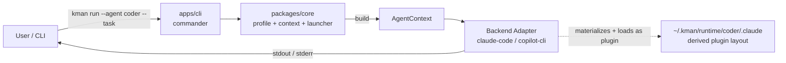
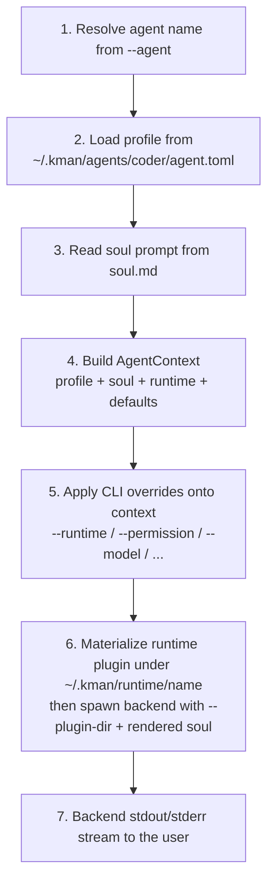

# Architecture

This page describes how a `kman run` invocation is assembled and executed.

## High-level flow



kman does **not** interpose on the backend's I/O stream. Backend output (text,
JSON, or backend-native stream) goes directly to the user's terminal. Session
state stays inside the backend's own storage.

## The `AgentContext` pipeline

Every `kman run` builds an immutable `AgentContext` **before** the backend is
spawned. All downstream components — the backend launcher and the hook runner
via the plugin — read from this single source of truth.



CLI overrides act on the **context**, not on the raw profile. The profile stays
immutable on disk.

## Backend adapter interface

Each backend lives in its own package (`packages/backend-<name>/`). v1 ships
`claude-code` and `copilot-cli` adapters. Adapters implement a common `Backend`
interface that exposes:

- `name` — the backend identifier.
- `capabilities` — feature flags probed at startup (see below).
- `spawn(ctx, opts)` — a one-shot run; stdout/stderr pass through to the caller.
- `chat(ctx, opts)` — an interactive REPL, passing stdin/stdout through transparently.
- `mapPermission(level)` — map the abstract permission level (`ask` / `auto` / `yolo`) to the backend-native mode.

Capabilities currently include:

- `supportClaudeCodePlugin` — can load the agent as a Claude Code plugin via `--plugin-dir`.
- `supportsAppendSystemPrompt` — can accept kman's rendered soul as an additional system prompt.
- `supportsNativeResume` — exposes a native `--resume` / `--continue` style flag.

Capability handling is **fail-fast** for required launch behavior: if a selected
backend cannot accept the rendered soul prompt, kman exits with code `4` before
spawning.

For backends with `supportClaudeCodePlugin = true` (both v1 backends), kman
materializes the agent into a backend-native plugin under
`~/.kman/runtime/<name>/` and points the backend's `--plugin-dir` at it,
selecting the contributed agent via `--agent kman:<name>`. The agent directory
itself is never passed to the backend. Future backends (codex/gemini) translate
the relevant subset of the layout into their native concepts, or declare those
features unsupported.

## Runtime plugin materialization

The plugin layout is a *backend implementation detail*, not agent data — so kman
keeps it out of the agent directory and materializes it on demand under
`~/.kman/runtime/<name>/`:

```
~/.kman/runtime/
├── mcp-config.json                    # shared kman-MCP injection config (see Multi-Agent Dispatch)
└── coder/
    ├── .claude/                       # complete Claude Code plugin (claude-code)
    │   ├── .claude-plugin/plugin.json #   { "name": "kman", "agents": ["./agents/coder.md"] }
    │   ├── agents/coder.md            #   → soul.md
    │   ├── skills/ hooks/ scripts/ bin/ commands/   # → agent dir (symlink, copy fallback)
    │   └── .mcp.json                  #   → agent dir (mcp.json)
    └── .copilot/                      # complete Copilot plugin (copilot-cli)
        ├── plugin.json                #   { "name": "kman", "agents": "agents/" }
        ├── agents/coder.agent.md      #   → soul.md (regenerated; copilot-cli requires the .agent.md suffix + a description:)
        ├── skills/ hooks/ scripts/ bin/ commands/
        └── .mcp.json
```

Key properties:

- **Fixed plugin name.** Every materialized plugin declares `"name": "kman"`, so the backend selector is always `kman:<agent>` (`--agent kman:coder`). The contributed agent's own name comes from `soul.md`'s YAML frontmatter `name:`.
- **Mapped, not copied.** Component dirs (`skills/`, `hooks/`, `scripts/`, `bin/`, `commands/`) and the agent's `mcp.json` (materialized as the backend dotfile `.mcp.json`) are symlinked back to the agent directory so edits stay in sync without duplication. On filesystems without symlink support, kman falls back to a recursive copy.
- **Rebuilt every launch.** The per-layout directory is removed and recreated on each spawn, so removed skills/hooks never linger as stale entries. The directory is derived state and safe to delete at any time. `kman agent rename` / `delete` drop the matching `~/.kman/runtime/<name>/` tree.
- **Loaded via `--plugin-dir`.** The backend points `--plugin-dir` at `~/.kman/runtime/<name>/.claude` (claude-code) or `.copilot` (copilot-cli).

Because the runtime directory is generated output, users should **not** edit
files there for persistent customization — edit the agent-directory files
instead (see [Agents & Profiles](./agents.md) and [Hooks & MCP](./hooks-and-mcp.md)).

## Repository layout

kman is a Bun + Turborepo monorepo:

```
kman/
├── apps/
│   └── cli/                          # @unliftedq/kman — the published CLI (binary: kman)
├── packages/                         # all internal, all private (not published)
│   ├── types/                        # @kman/types — shared interfaces (Profile, AgentContext, Backend)
│   ├── core/                         # @kman/core — profile, context, prompt, launcher, runtime materializer, doctor
│   ├── skills/                       # @kman/skills — source parsing + SKILL.md discovery + vendoring
│   ├── backend-base/                 # @kman/backend-base — spawn helpers
│   ├── backend-claude-code/          # @kman/backend-claude-code
│   ├── backend-copilot-cli/          # @kman/backend-copilot-cli
│   └── mcp-server/                   # @kman/mcp-server — stdio MCP server + auto-injection config
└── docs/                             # this documentation
```

### Toolchain

- Bun ≥ 1.2
- TypeScript 5.9
- Turborepo 2.x
- commander 14.x

## Design decision index

| # | Decision |
|---|---|
| 1 | Strict noun-verb CLI grammar; agent management may use positional names, other values use options. |
| 2 | Global-only agent storage (`~/.kman/agents/`). |
| 3 | Manager mode (no own runtime), pluggable backends. |
| 4 | TOML profile + standalone `soul.md`, delivered as a real system prompt. |
| 5 | The materialized runtime plugin follows the Claude Code plugin spec (layout, manifest, hooks, MCP servers). |
| 6 | v1 ships shell-pipe composition plus the kman MCP server for cross-agent dispatch. |
| 7 | v1 has no session layer; native backend sessions only. |
| 8 | `AgentContext` is the pipeline center; CLI overrides act on it, not the on-disk profile. |
| 9 | Skills: installed directories are the source of truth; SKILL.md discovery with interactive multi-select; `--ref` pinning. |
| 10 | Secrets via runtime `userConfig` or launch env; never plaintext config files. |
| 11 | Permission: abstract (`ask` / `auto` / `yolo`) plus a `--runtime-flag` raw escape hatch. |
| 12 | Hooks live in `hooks/hooks.json`; scripts in `scripts/`, referenced via `${CLAUDE_PLUGIN_ROOT}`. |
| 13 | TypeScript + Bun + Turborepo + commander. |
| 14 | Agent names are lowercase kebab-case; agent-scoped CLI option is `-a, --agent`. |
| 15 | Resume uses backend-native flags via `--runtime-flag`; a unified resume UX is future work. |

## Open risks

1. **Backend stability.** claude-code and copilot-cli change their CLI surface over time; adapter packages need active maintenance. Each adapter pins a minimum required version and probes capabilities at startup.
2. **Plugin spec drift.** The plugin layout and `${CLAUDE_PLUGIN_*}` substitution variables may evolve; the blast radius is limited to documentation and adapter capability flags.
3. **Skill update conflicts.** A `.kman-skill.json` checksum diverging from current files indicates local edits; kman refuses to overwrite without `--force` or `detach`.
4. **Secret availability.** MCP servers may require credentials via `userConfig` or environment; missing credentials surface via `kman doctor` and backend-side runtime errors.
5. **`bin/` namespace collisions.** Plugin executables become bare commands in the backend's Bash tool and can shadow system commands; prefer agent-specific prefixes for `bin/` entries.
