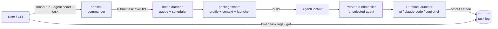
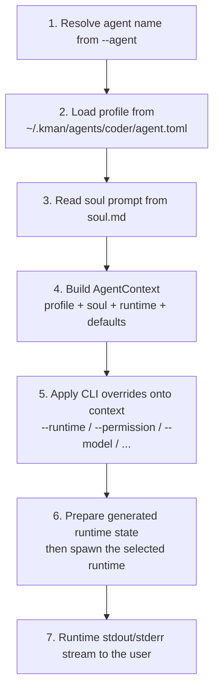

# Architecture

This page describes how an agent run is assembled and executed.

## High-level flow

`kman run` submits a task to the resident daemon, which assembles the
`AgentContext` and spawns the backend (capturing its output to a log).
`kman chat` runs the same assembly in-process and streams the backend straight
to your terminal.



For a daemon-launched run, backend output is captured to a per-task log
(`kman task logs <id>` reads it). For `kman chat`, kman does **not** interpose
on the backend's I/O stream — backend output goes directly to the user's
terminal. Session state stays inside the backend's own storage either way.

## The `AgentContext` pipeline

Every run builds an immutable `AgentContext` **before** the backend is
spawned. Downstream launch code reads from this single source of truth. For
`kman run` this happens inside the daemon's run manager; for `kman chat` it
happens in the foreground process.



CLI overrides act on the **context**, not on the raw profile. The profile stays
immutable on disk.

## Runtime handoff

Each runtime lives behind a small launcher package. A launcher is responsible for
translating the `AgentContext` into the selected runtime's command-line flags,
permission mode, working directory, and generated launch files.

The important user-facing behavior is:

- the agent directory (`~/.kman/agents/<name>/`) remains the source of truth;
- generated launch state lives under `~/.kman/runtime/<name>/`;
- generated state is rebuilt as needed and can be deleted safely;
- backend output streams directly to the user's terminal.

If a selected runtime cannot accept the rendered soul prompt or required launch
options, kman exits with code `4` before spawning it.

## Repository layout

kman is a Bun + Turborepo monorepo:

```
kman/
├── apps/
│   └── cli/                          # @unliftedq/kman — the published CLI (binary: kman)
├── packages/                         # all internal, all private (not published)
│   ├── types/                        # @kman/types — shared interfaces (Profile, AgentContext, Backend)
│   ├── core/                         # @kman/core — profile, context, prompt, launcher, doctor
│   ├── skills/                       # @kman/skills — source parsing + SKILL.md discovery + vendoring
│   ├── backend-base/                 # @kman/backend-base — spawn helpers
│   ├── backend-pi/                    # @kman/backend-pi — embedded pi SDK runtime (default)
│   ├── backend-claude-code/          # @kman/backend-claude-code
│   ├── backend-copilot-cli/          # @kman/backend-copilot-cli
│   └── mcp-server/                   # @kman/mcp-server — stdio MCP server + auto-injection config
└── docs/                             # this documentation
```

### Toolchain

- Bun ≥ 1.2
- TypeScript 5.9
- Turborepo 2.x
- commander 14.x

## Design decision index

| # | Decision |
|---|---|
| 1 | Strict noun-verb CLI grammar; agent management may use positional names, other values use options. |
| 2 | Global-only agent storage (`~/.kman/agents/`). |
| 3 | Manager mode (no own runtime), pluggable runtime launchers. |
| 4 | TOML profile + standalone `soul.md`, delivered as a real system prompt. |
| 5 | v1 ships shell-pipe composition plus the kman MCP server for cross-agent dispatch. |
| 6 | v1 has no session layer; native backend sessions only. |
| 7 | `AgentContext` is the pipeline center; CLI overrides act on it, not the on-disk profile. |
| 8 | Skills: installed directories are the source of truth; SKILL.md discovery with interactive multi-select; `--ref` pinning. |
| 9 | Secrets via runtime `userConfig` or launch env; never plaintext config files. |
| 10 | Permission: abstract (`ask` / `auto` / `yolo`) plus a `--runtime-flag` raw escape hatch. |
| 11 | Hooks live in `hooks/hooks.json`; scripts in `scripts/`. |
| 12 | TypeScript + Bun + Turborepo + commander. |
| 13 | Agent names are lowercase kebab-case; agent-scoped CLI option is `-a, --agent`. |
| 14 | Resume uses backend-native flags via `--runtime-flag`; a unified resume UX is future work. |

## Open risks

1. **Backend stability.** claude-code and copilot-cli change their CLI surface over time; adapter packages need active maintenance. Each adapter pins a minimum required version and probes capabilities at startup.
2. **Runtime integration drift.** Backend CLIs and hook/MCP formats may evolve; launcher packages and docs need to stay current.
3. **Skill update conflicts.** A `.kman-skill.json` checksum diverging from current files indicates local edits; kman refuses to overwrite without `--force` or `detach`.
4. **Secret availability.** MCP servers may require credentials via `userConfig` or environment; missing credentials surface via `kman doctor` and backend-side runtime errors.
5. **`bin/` namespace collisions.** Agent executables can become bare commands in supported runtime tool environments and shadow system commands; prefer agent-specific prefixes for `bin/` entries.
